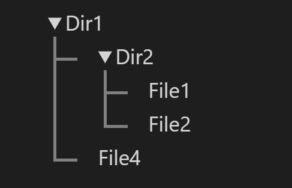

# About

A plugin for [markdown-it](https://github.com/markdown-it/markdown-it) to render nested tree structures in markdown. The tree is implemented as an unordered-list i.e. `<ul>` HTML element.

# Installation

```bash
npm install markdown-it-ultree
```

# Usage

```js
// Install `markdown-it` if you do not have it
const markdownIt = require('markdown-it');
const ultree = require('markdown-it-ultree');
const mdit = markdownIt();
mdit.use(ultree);
const output = mdit.render(`\`\`\`ultree
output: foldable

    Dir1
        Dir2
            File1
            File2
        File4

\`\`\``);

console.log(output);
```

## Output

### Raw text

```html
<div class="ultree"><ul><li><details open><summary>Dir1</summary><ul><li><details open><summary>Dir2</summary><ul><li>File1</li><li>File2</li></ul></details></li><li>File4</li></ul></details></li></ul></div>
```

### HTML output with styling



**NOTE**: This repo does not come with the CSS for the image shown above.

# Options

Options are specified at the beginning of the `ultree` block.

It is not mandatory to specify any options.

| Option     | Possible values | Description                      |
| ---------- | --------------- | -------------------------------- |
| **output** | `foldable`      | (default) Output a foldable tree |
|            | `simple`        | Output a non-foldable tree       |

# Important

- The tree can have only **one** root.
- Do not mix tabs and spaces for indentation within one `ultree` block. Either use spaces (recommended) or tabs.
- Keep the indentation consistent. e.g. if you indent by 4 spaces, do not indent by 2 spaces later on within the same `ultree` block.
